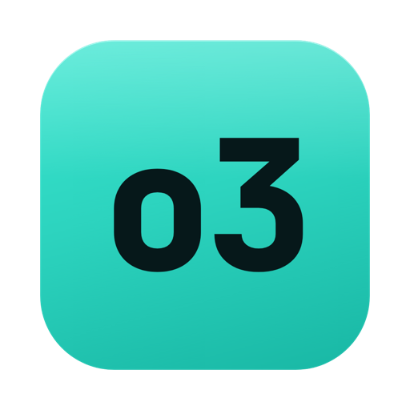

<div align="center">

<picture>
  <source media="(prefers-color-scheme: dark)" srcset="docs/assets/logo-dark.png">
  <source media="(prefers-color-scheme: light)" srcset="docs/assets/logo-light.png">
  
</picture>

# o3

**A fast, native desktop client for [OpenObserve](https://openobserve.ai).**

Query logs, explore metrics, and manage connections from a purpose-built macOS app —
no browser tab, no context switching.

Built with [Wails v2](https://wails.io) (Go backend) + [React](https://react.dev) / [TypeScript](https://www.typescriptlang.org) frontend.

[Features](#features) · [Screenshots](#screenshots) · [Download](#download--install) · [Getting started](#getting-started) · [Architecture](#architecture) · [Roadmap](#roadmap)

</div>

---

## Why o3

OpenObserve ships a capable web UI, but a desktop client buys you things a browser tab can't:
native window chrome, OS keychain-backed credential storage, instant startup, and a workflow
tuned for the query-inspect-refine loop instead of general-purpose dashboards.

o3 shares its Go client with the [`openobserve-cli`](https://github.com/angelmsger/openobserve-cli)
project, so the CLI and the GUI talk to OpenObserve through **exactly the same code** — they
cannot drift apart.

## Features

### 🔍 Logs explorer
- **CodeMirror 6 SQL editor** with grammar-based highlighting, real undo/redo, and
  `Cmd+Enter` to run — no hand-rolled textarea overlay.
- **Context-aware autocomplete** that suggests live stream fields, SQL keywords, and functions
  as you type, fully keyboard-navigable.
- **Multi-tab queries** with inline rename (double-click a tab) and per-tab result state.
- **Event-volume histogram** rendered with [Apache ECharts](https://echarts.apache.org),
  with hover tooltips over 30s buckets.
- **Result inspector drawer** — click any row to see the full record as formatted JSON,
  copy it, or drill in.
- **Value actions** — click any field value to filter for/exclude it, aggregate by it,
  or copy it; the SQL is rewritten for you.

### 📈 Metrics explorer
- **Native PromQL** range queries (`rate`, `p99`, error-rate expressions, …) against
  OpenObserve's Prometheus-compatible endpoint.
- **Multi-series line charts** with legend toggles, a shared-axis tooltip, and a `dataZoom`
  brush, all built on the reusable ECharts wrapper.
- Segmented time-range control with an automatic Prometheus step ladder (~120 points/range).

### 🔗 Connection management
- **Multiple contexts** — switch between staging, prod, and local instances from the title bar.
- **OS keychain-backed secrets** — passwords/tokens are stored via
  [go-keyring](https://github.com/zalando/go-keyring), never in plaintext config.
- **Setup wizard** and a **contexts manager** with a delete guard (you can't remove your last
  context) and live connection testing.

### 🎨 Design
- Dark, information-dense UI faithful to a single visual source of truth.
- **Dynamic accent color** — every chart, caret, and highlight reacts to the runtime accent
  set in Settings.

## Screenshots

> _Screenshots coming soon._ Run `wails dev` to see the app live.

## Download & install

Grab the latest installer for your OS from the
[Releases page](https://github.com/AngelMsger/o3/releases):

| OS | File | Install |
| --- | --- | --- |
| macOS 11+ (Apple Silicon + Intel) | `o3-<version>-universal.dmg` | Open the DMG, drag **o3** to Applications. |
| Windows | `o3-<version>-windows-amd64-setup.exe` | Run the installer. A portable `-portable.zip` is also provided. |
| Linux (glibc 2.35+) | `o3-<version>-x86_64.AppImage` | `chmod +x` it and run. |

> **Heads-up: the builds are currently unsigned.** Until code signing is in
> place, your OS will warn on first launch:
>
> - **macOS** — Gatekeeper says the app "cannot be opened". Right-click **o3** →
>   **Open** → **Open**, or clear the quarantine flag once:
>   `xattr -dr com.apple.quarantine /Applications/o3.app`
> - **Windows** — SmartScreen shows "Windows protected your PC". Click
>   **More info** → **Run anyway**.

## Getting started

### Prerequisites

| Tool | Version | Notes |
| --- | --- | --- |
| [Go](https://go.dev/dl/) | 1.24+ | backend + Wails |
| [Node](https://nodejs.org) | 20+ | frontend build |
| [Wails CLI](https://wails.io/docs/gettingstarted/installation) | v2.12+ | `go install github.com/wailsapp/wails/v2/cmd/wails@latest` |

o3 depends on the shared client from the sibling
[`openobserve-cli`](https://github.com/angelmsger/openobserve-cli) repo via a Go workspace
(`go.work`). Check both repos out side by side so the `replace` directive in `go.mod`
resolves.

### Develop

```sh
wails dev
```

Live-reloads both the Go backend and the React frontend.

### Build

```sh
wails build
```

Produces a native `.app` bundle under `build/bin/`.

### Package installers

The [`Makefile`](Makefile) wraps `wails build` with the per-OS packaging steps —
each target builds on its own platform (Windows cross-compiles from any host):

```sh
make dmg        # macOS  → build/bin/o3-<version>-universal.dmg (needs dmgbuild)
make installer  # Windows → build/bin/o3-<version>-windows-amd64-setup.exe (needs makensis)
make appimage   # Linux  → build/bin/o3-<version>-x86_64.AppImage
```

`VERSION` defaults to the current git tag; override with `make dmg VERSION=1.2.3`.

Releases are automated: pushing a `v*.*.*` tag runs
[`.github/workflows/release.yml`](.github/workflows/release.yml), which builds
all three platforms in a matrix and attaches the installers to a **draft**
GitHub Release for review. The workflow checks out the sibling `openobserve-cli`
repo automatically to satisfy the `go.work` dependency.

### Test

```sh
# Go
go test ./...

# Frontend
cd frontend && npm test
```

## Architecture

```
┌─────────────────────────────────────────────┐
│  React + TypeScript (frontend/)              │
│  CodeMirror 6 editor · ECharts viz · views   │
└───────────────┬─────────────────────────────┘
                │ Wails-generated TS bindings
┌───────────────┴─────────────────────────────┐
│  Go app layer (app.go, internal/)            │
│  contexts · query · metrics · config · errs  │
└───────────────┬─────────────────────────────┘
                │ shared client (go.work)
┌───────────────┴─────────────────────────────┐
│  openobserve-cli/pkg/{apiclient,auth,config} │
│  the single source of truth for the O2 API   │
└──────────────────────────────────────────────┘
```

- **`app.go`** exposes a small, typed surface to the frontend: `ListContexts`,
  `SwitchContext`, `SaveContext`, `RemoveContext`, `TestConnection`, `ListStreams`,
  `GetFields`, `RunQuery`, and `RunMetricsQuery`.
- **`internal/query`** builds and runs log searches; **`internal/metrics`** maps PromQL matrix
  responses into chart-ready series; **`internal/config`** manages contexts and keychain
  secrets; **`internal/apperr`** normalizes backend errors for the UI.
- **`frontend/src/components/charts/`** holds a reusable `<EChart>` wrapper plus pure
  option-builders (`buildHistogramOption`, `buildMetricsOption`) — the foundation every future
  visualization reuses.

## Roadmap

o3 is under active development. The logs and metrics explorers are functional; the remaining
navigation surfaces are scaffolded and being built out.

| Area | Status |
| --- | --- |
| Logs explorer (editor, histogram, inspector, value actions) | ✅ Shipped |
| Metrics explorer (PromQL, multi-series charts) | ✅ Shipped |
| Multi-context connection management + keychain | ✅ Shipped |
| **Traces** — span waterfall, service map | 🚧 Scaffolded |
| **Dashboards** — saved multi-panel layouts | 🚧 Scaffolded |
| **Streams** — schema browser, retention & ingestion stats | 🚧 Scaffolded |
| **Alerts** — rule authoring and status | 🚧 Scaffolded |
| Saved queries & shareable links | 📋 Planned |
| Cross-platform builds (macOS · Windows · Linux) + GitHub Release automation | ✅ Shipped |
| Code signing / notarization & auto-update | 📋 Planned |

Legend: ✅ shipped · 🚧 in progress · 📋 planned

## Tech stack

- **Shell:** [Wails v2](https://wails.io)
- **Backend:** [Go](https://go.dev) 1.24, [go-keyring](https://github.com/zalando/go-keyring)
- **Frontend:** [React 18](https://react.dev), [TypeScript](https://www.typescriptlang.org), [Vite](https://vite.dev)
- **Editor:** [CodeMirror 6](https://codemirror.net) (`@codemirror/lang-sql`, `@codemirror/autocomplete`)
- **Charts:** [Apache ECharts](https://echarts.apache.org)
- **Tests:** [Vitest](https://vitest.dev), Go `testing`

## License

[MIT](LICENSE) © AngelMsger

---

<div align="center">
<sub>Built by <a href="https://github.com/AngelMsger">AngelMsger</a> · <a href="https://github.com/AngelMsger/o3">Source</a> · <a href="https://github.com/AngelMsger/o3/issues">Issues</a></sub>
</div>
