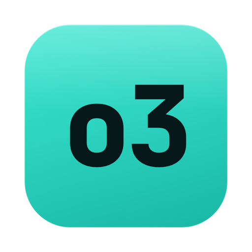

<div align="center">

<picture>
  <source media="(prefers-color-scheme: dark)" srcset="docs/assets/logo-dark.png">
  <source media="(prefers-color-scheme: light)" srcset="docs/assets/logo-light.png">
  
</picture>

# o3

**A fast, native desktop client for [OpenObserve](https://openobserve.ai).**

Query logs, explore metrics, and manage connections from a purpose-built desktop app.

Built with [Wails v2](https://wails.io) (Go backend) + [React](https://react.dev) / [TypeScript](https://www.typescriptlang.org) frontend.

[Project status](#project-status) · [Features](#features) · [Demo](#demo) · [Download](#download--install) · [Build from source](#build-from-source) · [Architecture](#architecture)

</div>

> [!IMPORTANT]
> **o3 is archived.** Development is paused indefinitely and this repository is read-only.
> [v0.3.0](https://github.com/AngelMsger/o3/releases/tag/v0.3.0) is the final release: it still
> works and remains available to download, but it will not receive fixes or new features.
> We now query OpenObserve by talking to an AI agent in the terminal, using
> [`openobserve-cli`](https://github.com/AngelMsger/openobserve-cli) ([read why](#project-status)).

## Project status

**Development of o3 was paused in October 2026.** Nothing went wrong with the project; the
way we work changed around it.

o3 began with a simple premise. OpenObserve ships a capable web UI, but a desktop client can
offer what a browser tab can't: native window chrome, credentials kept in the OS keychain,
instant startup, and a workflow tuned for the query-inspect-refine loop rather than
general-purpose dashboards. So we built one, with an editor that knows your stream's fields,
a histogram of event volume, and an inspector for every record.

What has changed since then is who runs that loop. AI models and the tooling around them have
matured to the point where, more often than not, we no longer write the query ourselves. We
open a terminal and describe the problem to a coding agent. The agent finds the right stream,
writes the SQL or PromQL, reads the results, and refines the query until it has an answer.
That is more efficient than driving a GUI by hand, and it fits naturally into the agent
ecosystem: the agent that reads the logs is the same one already working on the code.

With that as our everyday workflow, we no longer need a complex desktop client, and so we
have paused work on it.

### What this means for you

- **v0.3.0 is the final release.** The installers stay on the
  [Releases page](https://github.com/AngelMsger/o3/releases/tag/v0.3.0) and the
  [project site](https://angelmsger.github.io/o3/), and the app keeps working as it does today.
- **It is frozen.** There will be no bug fixes, security updates, or new features, and no
  adjustments if a future OpenObserve release changes the APIs o3 relies on.
- **The repository is read-only.** Issues and pull requests are closed to new activity.
- **The code stays open.** Everything here remains under the [MIT license](LICENSE); you are
  welcome to read it, fork it, and build on it.

### What we use now

[`openobserve-cli`](https://github.com/AngelMsger/openobserve-cli) is o3's command-line
sibling. o3 is built on its Go client, so the two have always talked to OpenObserve through
exactly the same code. The CLI is designed for coding agents first and people second: it
covers logs, metrics, and traces, returns structured JSON, and ships a companion Skill that
teaches agents such as Claude Code, Codex, and Cursor how to use it.

```sh
npm install -g @angelmsger/openobserve-cli   # install the CLI
openobserve-cli skill install                # teach your coding agent to use it
```

Then ask your agent the question you would have turned into a query yourself — *"why did
checkout errors spike in the last hour?"* — and let it do the digging.

If you already use o3, there is nothing to migrate: the CLI reads the same configuration
file and keychain entries, so `openobserve-cli config contexts` already lists your contexts.
o3 can also run the two commands above for you, under **Settings → AI Ecosystem**.

If you are starting fresh, `openobserve-cli config init --pretty` walks you through
connecting to your instance. The
[CLI documentation](https://angelmsger.github.io/openobserve-cli/) covers everything else.

## Features

Everything below describes the app as it ships in v0.3.0.

### 🔍 Logs explorer
- **CodeMirror 6 SQL editor** with grammar-based highlighting, real undo/redo, and
  `Cmd+Enter` to run.
- **Context-aware autocomplete** that suggests live stream fields, SQL keywords, and functions
  as you type, fully keyboard-navigable.
- **Multi-tab queries** with inline rename (double-click a tab) and per-tab result state.
- **Event-volume histogram** rendered with [Apache ECharts](https://echarts.apache.org),
  with hover tooltips over 30s buckets.
- **Result inspector drawer** — click any row to see the full record as formatted JSON,
  copy it, or drill in.
- **Value actions** — click any field value to filter for/exclude it, aggregate by it,
  or copy it; the SQL is rewritten for you.

### 📈 Metrics explorer
- **Native PromQL** range queries (`rate`, `p99`, error-rate expressions, …) against
  OpenObserve's Prometheus-compatible endpoint.
- **Multi-series line charts** with legend toggles, a shared-axis tooltip, and a `dataZoom`
  brush, all built on the reusable ECharts wrapper.
- Segmented time-range control with an automatic Prometheus step ladder (~120 points/range).

### 🔗 Connection management
- **Multiple contexts** — keep staging, prod, and local instances side by side; every query
  tab is bound to its own context.
- **Browser sign-in on every platform** — log in through your instance's own web login (SSO
  included) and o3 captures the session. macOS uses a native WebView window; Windows and Linux
  drive your Chromium-family browser over the DevTools Protocol. The capture core is shared
  with [`openobserve-cli`](https://github.com/AngelMsger/openobserve-cli), so both clients
  agree on when a login has actually completed.
- **OS keychain-backed secrets** — passwords/tokens are stored via
  [go-keyring](https://github.com/zalando/go-keyring), never in plaintext config.
- **Setup wizard** and a **contexts manager** with a delete guard (you can't remove your last
  context) and live connection testing.

### 🤖 AI ecosystem
- **CLI and Skill management** — a Settings pane, with a shortcut in the nav rail, that
  detects, installs, upgrades, and removes
  [`openobserve-cli`](https://github.com/AngelMsger/openobserve-cli) and its companion Skill
  for coding agents.

### 🎨 Design
- Information-dense UI in dark and light themes.
- **Dynamic accent color** — every chart, caret, and highlight reacts to the runtime accent
  set in Settings.

### What was never built

The nav rail also lists **Traces**, **Dashboards**, **Streams**, and **Alerts**, but those
entries open placeholder views; none of them was built out. Saved queries, shareable links,
and code signing were planned and never started. Of these, traces are already covered on the
command line: [`openobserve-cli`](https://github.com/AngelMsger/openobserve-cli) can list
recent traces and reassemble one into a span waterfall.

## Demo

The [project site](https://angelmsger.github.io/o3/) hosts an interactive demo of the logs
explorer that runs entirely in your browser — the quickest way to see what o3 looks and feels
like without installing it.

## Download & install

The final release is [v0.3.0](https://github.com/AngelMsger/o3/releases/tag/v0.3.0). Its
installers remain available:

| OS | File | Install |
| --- | --- | --- |
| macOS 11+ (Apple Silicon + Intel) | [`o3-0.3.0-universal.dmg`](https://github.com/AngelMsger/o3/releases/download/v0.3.0/o3-0.3.0-universal.dmg) | Open the DMG, drag **o3** to Applications. |
| Windows | [`o3-0.3.0-windows-amd64-setup.exe`](https://github.com/AngelMsger/o3/releases/download/v0.3.0/o3-0.3.0-windows-amd64-setup.exe) | Run the installer. A [portable zip](https://github.com/AngelMsger/o3/releases/download/v0.3.0/o3-0.3.0-windows-amd64-portable.zip) is also provided. |
| Linux (glibc 2.35+) | [`o3-0.3.0-x86_64.AppImage`](https://github.com/AngelMsger/o3/releases/download/v0.3.0/o3-0.3.0-x86_64.AppImage) | `chmod +x` it and run. |

> **Heads-up: the builds are unsigned**, so your OS will warn on first launch:
>
> - **macOS** — Gatekeeper says the app "cannot be opened". Try to open it once,
>   then go to **System Settings → Privacy & Security** and click **Open Anyway**
>   (macOS 15 Sequoia removed the old right-click → Open bypass for unsigned
>   apps; on macOS 14 and earlier that shortcut still works too). Or clear the
>   quarantine flag once: `xattr -dr com.apple.quarantine /Applications/o3.app`.
>   The install window of the DMG carries the same hint.
> - **Windows** — SmartScreen shows "Windows protected your PC". Click
>   **More info** → **Run anyway**.

o3 includes a built-in updater ([Sparkle](https://sparkle-project.org) on macOS,
[WinSparkle](https://winsparkle.org) on Windows, a notification on Linux). With v0.3.0 as the
final release it has nothing left to fetch; [docs/auto-update.md](docs/auto-update.md)
describes how it works.

## Build from source

The source still builds, and these instructions are kept for anyone who wants to run,
study, or fork o3.

### Prerequisites

| Tool | Version | Notes |
| --- | --- | --- |
| [Go](https://go.dev/dl/) | 1.24+ | backend + Wails |
| [Node](https://nodejs.org) | 20+ | frontend build |
| [Wails CLI](https://wails.io/docs/gettingstarted/installation) | v2.12+ | `go install github.com/wailsapp/wails/v2/cmd/wails@latest` |

o3 depends on the shared client from
[`openobserve-cli`](https://github.com/AngelMsger/openobserve-cli) through a Go workspace
(`go.work`) and a `replace` directive in `go.mod`. Both expect that repo at
`../oa-cli/src/openobserve-cli`, relative to this one. v0.3.0 was built against
openobserve-cli `v0.10.0`, so check the two out like this:

```sh
git clone https://github.com/AngelMsger/o3.git
git clone --branch v0.10.0 https://github.com/AngelMsger/openobserve-cli.git oa-cli/src/openobserve-cli
cd o3
```

### Develop

```sh
wails dev
```

Live-reloads both the Go backend and the React frontend.

### Build

```sh
wails build
```

Produces a native build for the current platform under `build/bin/` (an `.app` bundle on
macOS).

### Package installers

The [`Makefile`](Makefile) wraps `wails build` with the per-OS packaging steps —
each target builds on its own platform (Windows cross-compiles from any host):

```sh
make dmg        # macOS  → build/bin/o3-<version>-universal.dmg (needs dmgbuild)
make installer  # Windows → build/bin/o3-<version>-windows-amd64-setup.exe (needs makensis)
make appimage   # Linux  → build/bin/o3-<version>-x86_64.AppImage
```

`VERSION` defaults to the current git tag; override with `make dmg VERSION=1.2.3`.
Add `NATIVE_UPDATER=1` to reproduce the release configuration with the native
auto-updater compiled in (see [docs/auto-update.md](docs/auto-update.md)).

Releases were cut by pushing a `v*.*.*` tag, which ran
[`.github/workflows/release.yml`](.github/workflows/release.yml): it built all three
platforms in a matrix, checked out `openobserve-cli` to satisfy the `go.work` dependency,
and attached the installers to a **draft** GitHub Release for review. GitHub Actions does
not run in an archived repository, so the workflow is kept for reference only. A fork can
reuse it, but needs its own update-signing key first (see
[docs/auto-update.md](docs/auto-update.md)).

### Test

```sh
# Go
go test ./...

# Frontend
cd frontend && npm test
```

## Architecture

```
┌─────────────────────────────────────────────┐
│  React + TypeScript (frontend/)              │
│  CodeMirror 6 editor · ECharts viz · views   │
└───────────────┬─────────────────────────────┘
                │ Wails-generated TS bindings
┌───────────────┴─────────────────────────────┐
│  Go app layer (app.go, internal/)            │
│  contexts · query · metrics · config · errs  │
└───────────────┬─────────────────────────────┘
                │ shared client (go.work)
┌───────────────┴─────────────────────────────┐
│  openobserve-cli/pkg/{apiclient,auth,config, │
│                       webauth}               │
│  the single source of truth for the O2 API   │
└──────────────────────────────────────────────┘
```

- **`app.go`** exposes a typed surface to the frontend. Its core is `ListContexts`,
  `UseContext`, `SaveContext`, `RemoveContext`, `TestConnection`, `ListStreams`, `GetFields`,
  `RunQuery`, and `RunMetricsQuery`, alongside bindings for browser sign-in, preferences,
  updates, and the AI Ecosystem pane.
- **`internal/query`** builds and runs log searches; **`internal/metrics`** maps PromQL matrix
  responses into chart-ready series; **`internal/config`** manages contexts and keychain
  secrets; **`internal/apperr`** normalizes backend errors for the UI.
- **`frontend/src/components/charts/`** holds a reusable `<EChart>` wrapper plus pure
  option-builders (`buildHistogramOption`, `buildMetricsOption`) — the foundation shared by
  the logs histogram and the metrics charts.

## Tech stack

- **Shell:** [Wails v2](https://wails.io)
- **Backend:** [Go](https://go.dev) 1.24, [go-keyring](https://github.com/zalando/go-keyring)
- **Frontend:** [React 18](https://react.dev), [TypeScript](https://www.typescriptlang.org), [Vite](https://vite.dev)
- **Editor:** [CodeMirror 6](https://codemirror.net) (`@codemirror/lang-sql`, `@codemirror/autocomplete`)
- **Charts:** [Apache ECharts](https://echarts.apache.org)
- **Tests:** [Vitest](https://vitest.dev), Go `testing`

## License

[MIT](LICENSE) © AngelMsger

---

<div align="center">
<sub>Built by <a href="https://github.com/AngelMsger">AngelMsger</a> · <a href="https://github.com/AngelMsger/o3">Source</a> · <a href="https://github.com/AngelMsger/o3/releases">Releases</a> · <a href="https://github.com/AngelMsger/openobserve-cli">openobserve-cli</a></sub>
</div>
